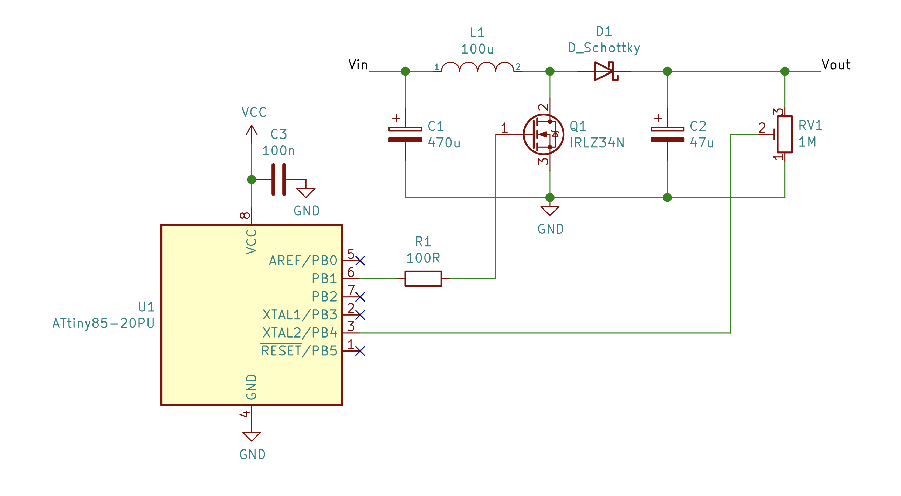

## Shiny PWM

Highly configurable voltage feedback PWM controller for ATtiny85. Useful for DIY switch-mode DC/DC converters.

## Features

- Configurable switching frequency range from 10 Hz - 32 MHz
- Feedback sampling rate of ~20 kHz
- Rolling averaging of feedback ADC readings or higher resolution and stability
- Configurable duty cycle limits
- Configurable voltage reference (internal 1.1V, internal 2.56V or VCC) 

## Usage

Connect pin 6 to the switch and connect the feedback voltage to pin 3. The controller will continuously adjust the PWM duty cycle so as to keep the feedback voltage at half the reference voltage.

Simplified schematic for an example application (DC/DC boost converter). Vout is determined by the trimmer potentiometer. In real world you probably want to include a gate driver between the MCU and the MOSFET and add some sort of overvoltage protection.

## Configuration

See comments in [`config.h`](./include/config.h) for documentation of different configuration parameters.

## Building

This project uses PlatformIO. See [`platformio.ini`](./platformio.ini) for optimal fuse settings.